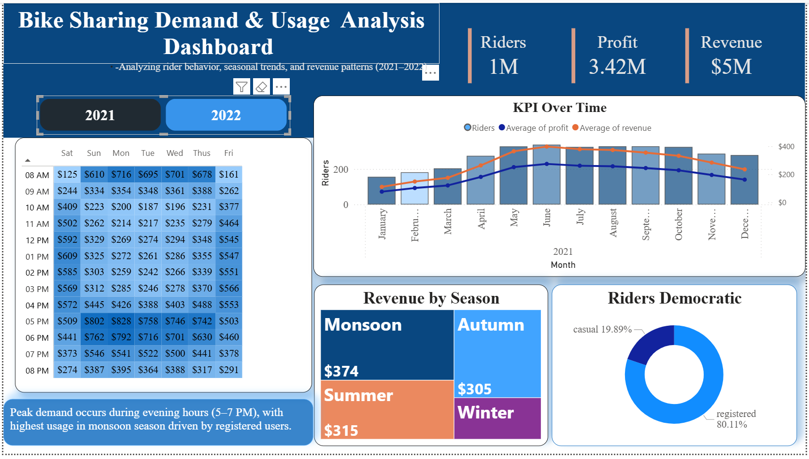
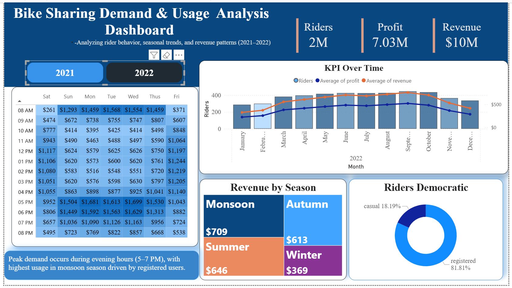

# 🚲 Bike Sharing Demand & Usage Analysis Dashboard (SQL + Power BI)

## 📌 Project Overview
This project focuses on analyzing bike sharing data to uncover patterns in rider behavior, seasonal trends, and revenue generation.  
The goal is to transform raw data into meaningful insights using SQL and visualize them through an interactive Power BI dashboard.

---

## 🎯 Objective
- Understand rider demand patterns across time
- find out Key Performance Metrics (KPI)
- Analyze seasonal impact on bike usage
- Identify peak hours and high-revenue periods
- Rider Demographics : Compare registered vs casual users

---

## 🛠️ Tools & Technologies Used
- SQL (Data Cleaning & Transformation)
- Power BI (Dashboard & Visualization)
- Excel/CSV (Dataset)

---

## 📂 Dataset Description
The dataset consists of bike sharing data for:
- Year 2021 and 2022
- Hourly usage data
- Rider types (casual & registered)
- Seasonal and weekday information

---

## 🧹 Data Cleaning & Preparation
The following steps were performed using SQL:

- Checked dataset size and structure
- Handled missing values using mean imputation
- Verified and corrected data types
- Removed duplicate records
- Combined multiple datasets using UNION
- Created calculated columns:
  - Revenue = riders × price
  - Profit = riders * (revenue −  COGS)

---

## 🔍 SQL Query (Core Transformation)

```sql
WITH combined AS (
    SELECT * FROM bike_share_yr_0
    UNION ALL
    SELECT * FROM bike_share_yr_1
)

SELECT 
    dteday,
    season,
    a.yr,
    weekday,
    hr,
    rider_type,
    riders,
    price,
    COGS,
    riders * price AS revenue,
    riders * price - COGS AS profit
FROM combined AS a
LEFT JOIN cost_table AS c
ON a.yr = c.yr;
```

## Dashboard Features

  📈 KPI Cards showing total Riders, Revenue, and Profit
  🔥 Heatmap representing hourly demand across weekdays
  📅 Time-series trend analysis for key performance metrics(KPI)
  🌦️ Seasonal revenue comparison across  4 seasons : Monsoon , Autumn , Summer and Winter 
  👥 Rider demographic distribution (casual vs registered)
  🎯 Highlighted key insight section

##💡 Key Insights
  - Both average revenue and profit increased from 2021 to 2022 
  - Peak demand occurs during morning(8-9am) evening hours ( 5– 7 PM)
  - Monsoon season shows highest revenue generation
  - Registered users contribute majority of rides (~81%)
  - Weekends show different demand patterns compared to weekdays


🖼️ Dashboard Preview
<p align="center">
  
  
  <p align="center"><b>Year-wise Metrics (2021 vs 2022)</b></p>
  <p align="center">
    
  </p>
  <p align="center"><b>Combined View of Both Years</b></p>
</p>

## 📁 Project Structure

```
bike-sharing-analytics/
│
├── Dashboard/
│   └── bike_share_bi_dashboard.pbix        # Power BI dashboard file
│   └── 2021.png
│   └── 2022.png
│   └── Over_All View.png
│
├── Datasets
│   ├── bike_share_yr_0.csv               # 2021 dataset
│   ├── bike_share_yr_1.csv               # 2022 dataset
│   └── cost_table.csv                   # Cost & pricing data
│
├── Requirements /
│   └── Client-Requirements.png
├── sql/
│   └── Query.sql
│   └── SQL.txt
│
└── README.md                            # Project documentation
```


## ▶️ How to Use Download the .pbix file
  - Open in Power BI Desktop
  - Load dataset if required
  - Interact with filters (Year, Season, Rider Type)


## 📌 Future Improvements
  - Add forecasting using time series analysis
  - Implement dynamic tooltips
  - Enhance UI with advanced interactions
